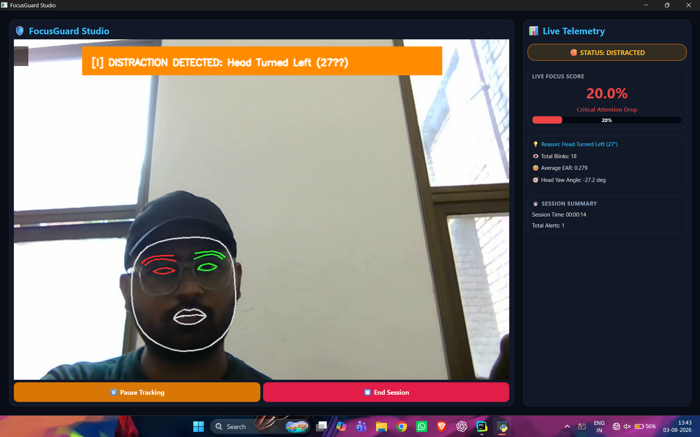
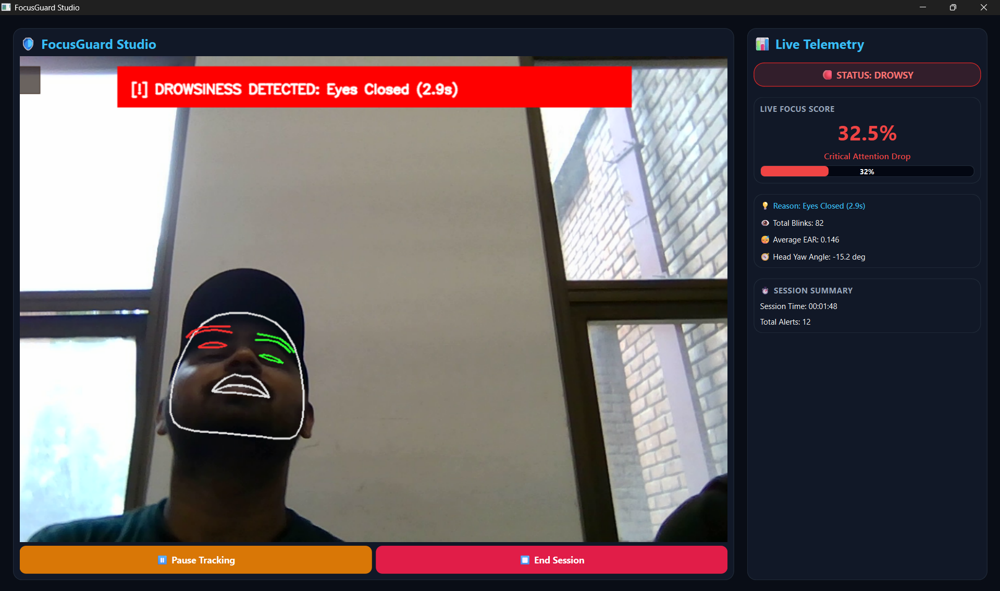
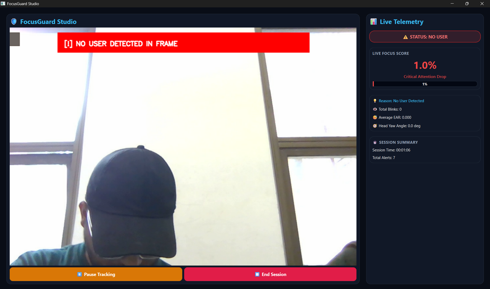

# 🛡️ FocusGuard Studio

> **AI-powered desktop application for real-time focus monitoring using Computer Vision, Interpretable AI, and Edge Computing.**

FocusGuard Studio is a real-time desktop application that continuously monitors user attention using Computer Vision and interpretable rule-based decision logic. The system performs facial landmark detection, blink analysis, drowsiness detection, and 3D head pose estimation to evaluate focus levels entirely on the local machine without requiring cloud connectivity.

Built with **Python, PyQt6, OpenCV, MediaPipe, and SQLite**, the application follows a modular multi-threaded architecture that separates the computer vision pipeline from the user interface, ensuring smooth real-time performance. Every focus state is accompanied by a transparent, human-readable reason, making the system interpretable and deterministic.

---

## ✨ Key Features

- 🎯 **Real-Time Face Mesh Tracking:** 478-point MediaPipe Face Mesh with refined landmark analysis.
- 👁️ **Blink & EAR Analysis:** Eye Aspect Ratio calculation for blink frequency and eye-closure analysis.
- 😴 **Micro-Sleep & Drowsiness Detection:** Real-time detection of prolonged eye closure.
- 🧭 **3D Head Pose Estimation:** Perspective-n-Point (`solvePnP`) based Yaw, Pitch, and Roll calculation.
- 🧠 **Interpretable Focus Engine:** Priority-based rule evaluation with human-readable telemetry reasons.
- 📈 **Dynamic Focus Scoring:** Continuous focus score calculation with smooth score damping.
- 💻 **PyQt6 Desktop Dashboard:** Multi-threaded desktop interface with live webcam feed and telemetry.
- 🚨 **Distraction Alerts:** Visual alerts for significant head movement, drowsiness, and user absence.
- 💾 **SQLite Session Logging:** Local storage for session telemetry, events, and performance metrics.
- 📊 **Session Performance Summary:** Post-session focus grading, duration, alerts, blink count, and focus statistics.
- 🔒 **100% Offline Edge Processing:** Video and telemetry processing remain on the local machine with no cloud dependency.

---

## 🛠️ Tech Stack

| Category | Technologies |
|---|---|
| **Language** | Python 3.11 |
| **Desktop Framework** | PyQt6 |
| **Computer Vision** | OpenCV (`opencv-contrib-python`) |
| **Landmark Tracking** | MediaPipe Face Mesh |
| **Numerical Processing** | NumPy |
| **Database & Storage** | SQLite3 |
| **Threading** | PyQt6 `QThread` |
| **Architecture** | Modular Multi-threaded Pipeline |
| **Decision Logic** | Interpretable Priority-Based Focus Engine |

---

## 🏗️ Architecture

FocusGuard separates camera acquisition, computer vision processing, state evaluation, analytics, and UI rendering into independent components to maintain low-latency real-time operation.

### Core Modules

- `vision/` — Camera frame acquisition, stream lifecycle, and camera interface.
- `tracking/` — Facial landmark extraction, EAR calculation, blink analysis, and `solvePnP` head pose estimation.
- `core/` — Focus engine, state transitions, score damping, and telemetry coordination.
- `ui/` — PyQt6 main window, camera worker thread, HUD rendering, live telemetry, and summary dialogs.
- `analytics/` — Session statistics, focus percentage calculations, and performance grading.
- `database/` — SQLite schema, session records, and performance metric persistence.
- `utils/` — Logging utilities, geometric helpers, and shared application utilities.
- `tests/` — Project tests and validation components.

---

## 🧠 How It Works

```text
                         Camera Frame
                              │
                              ▼
                  MediaPipe Face Mesh
                    478 Refined Landmarks
                              │
                              ▼
                 Facial Landmark Extraction
                              │
            ┌─────────────────┼─────────────────┐
            │                 │                 │
            ▼                 ▼                 ▼
      Eye Analysis       Head Pose        Face Presence
      EAR / Closure      solvePnP          Detection
            │                 │                 │
            └─────────────────┼─────────────────┘
                              ▼
                 Interpretable Focus Engine
                  Priority-Based Rule Engine
                              │
                              ▼
                    Focus Score + Telemetry
                              │
                              ▼
                    Live PyQt6 Dashboard
                    + HUD + Alerts
                              │
                              ▼
                   SQLite Session Storage
                              │
                              ▼
                Post-Session Performance Report
```

The system evaluates multiple visual signals independently and combines them through a deterministic priority-based decision engine.

For example, the system can produce human-readable states such as:

```text
Head Turned Right
Eyes Closed
No User Detected
Highly Attentive
```

This allows the application to provide not only a focus score, but also an understandable explanation of **why** a particular state was detected.

---

## 📊 Focus & Attention Signals

FocusGuard evaluates several visual indicators during a session.

### 👁️ Eye Behavior

The system analyzes facial eye landmarks to calculate **Eye Aspect Ratio (EAR)** and identify:

- Normal eye state
- Blinks
- Prolonged eye closure
- Potential drowsiness / micro-sleep conditions

### 🧭 Head Pose

Facial landmarks are used with OpenCV's `solvePnP` approach to estimate:

- **Yaw** — left/right head rotation
- **Pitch** — upward/downward movement
- **Roll** — head tilt

Significant head movement can contribute to distraction detection.

### 👤 Face Presence

FocusGuard continuously checks whether a face is available in the camera frame.

If the user leaves the frame, the system can transition into:

```text
NO USER DETECTED
```

and adjust the focus score accordingly.

### 🧠 Interpretable Decision Logic

Rather than producing an unexplained prediction, the focus engine evaluates prioritized states and associates each state with a human-readable reason.

This makes the system:

- Deterministic
- Interpretable
- Debuggable
- Transparent to the user

---

## 📈 Live Telemetry

During an active session, FocusGuard provides real-time telemetry including:

- Current focus score
- Attention state
- Detection reason
- Total blink count
- Average EAR
- Head yaw angle
- Session duration
- Total alerts

The interface also provides visual HUD overlays for important detection events.

---

## 📊 Session Performance

At the end of a session, FocusGuard generates a performance summary containing information such as:

- Average focus score
- Overall performance grade
- Session duration
- Lowest focus dip
- Total blink count
- Distraction / drowsiness alerts

Session information is persisted locally using SQLite for future analysis and historical tracking.

---

## 🔐 Privacy & Offline Processing

FocusGuard is designed around **local-first processing**.

### No cloud dependency

All major processing takes place locally:

```text
Webcam
   ↓
Local Computer Vision
   ↓
Local Focus Engine
   ↓
Local SQLite Database
```

No video streaming or cloud inference service is required for the core application.

### Privacy

The application does not require a remote server to process webcam frames.

This makes FocusGuard suitable for environments where webcam data should remain on the local machine.

---

## 📁 Project Structure

```text
focus-guard-vision/
│
├── analytics/
│   └── Session analysis and performance calculations
│
├── assets/
│   └── Application assets and screenshots
│
├── config/
│   └── Application configuration and settings
│
├── core/
│   └── Focus engine, telemetry, and vision pipeline
│
├── database/
│   └── SQLite database layer and persistence
│
├── tests/
│   └── Project tests and validation
│
├── tracking/
│   └── Face mesh, eye tracking, blink detection,
│       and head pose estimation
│
├── ui/
│   └── PyQt6 interface, camera worker,
│       HUD renderer, and session dialogs
│
├── utils/
│   └── Logging and shared utilities
│
├── vision/
│   └── Camera stream and frame acquisition
│
├── main.py
├── requirements.txt
├── requirements-lock.txt
├── LICENSE
└── README.md
```

---

## 🚀 Installation

### 1. Clone the repository

```bash
git clone https://github.com/ArpitVentures/focus-guard-vision.git
cd focus-guard-vision
```

### 2. Create a virtual environment

#### Windows

```powershell
python -m venv .venv
.venv\Scripts\activate
```

#### macOS / Linux

```bash
python3 -m venv .venv
source .venv/bin/activate
```

### 3. Install dependencies

```bash
python -m pip install --upgrade pip
pip install -r requirements.txt
```

### 4. Run FocusGuard Studio

```bash
python main.py
```

A webcam is required for real-time monitoring.

---

## ⚙️ Environment & Dependency Notes

FocusGuard currently uses a tested dependency combination for its computer vision pipeline.

Key versions include:

```text
Python                 3.11
NumPy                  1.26.4
OpenCV                 4.11.0
opencv-contrib-python  4.11.0.86
MediaPipe              0.10.21
PyQt6                  6.9.1
```

The project uses **`opencv-contrib-python`** for OpenCV functionality.

Avoid installing `opencv-python` alongside `opencv-contrib-python`, as both packages provide the `cv2` module and can cause conflicts within the same environment.

For a reproducible environment, the repository also provides:

```text
requirements-lock.txt
```

which contains the exact dependency versions from a verified working environment.

---

## 📸 Demo

FocusGuard Studio provides a desktop interface designed around real-time visual feedback.

The application displays:

- 🎯 Live focus score
- 🟢 Current attention state
- 💡 Human-readable detection reason
- 👁️ Blink and EAR telemetry
- 🧭 Head pose measurements
- 🚨 Distraction and drowsiness alerts
- ⏱️ Session duration
- 📊 Post-session performance summary

### 🎯 Real-Time Distraction Detection

FocusGuard detects significant head movement and provides an explainable distraction alert with the current head yaw angle and focus score.



### 😴 Drowsiness Detection

The system detects prolonged eye closure and identifies potential drowsiness in real time using eye landmark analysis.



### 🚫 No User Detection

FocusGuard automatically detects when the user leaves the camera frame and updates the focus score accordingly.



> The screenshots demonstrate the application's interface and detection states.

---

## 🧪 Example Detection States

### 🎯 Focused

```text
STATUS: HIGHLY ATTENTIVE

Focus Score: 94%
Reason: Normal Attention
```

### 🚨 Distraction

```text
STATUS: DISTRACTED

Reason: Head Turned Right
Head Yaw Angle: 34°
```

### 😴 Drowsiness

```text
STATUS: DROWSY

Reason: Eyes Closed
```

### 🚫 User Absence

```text
STATUS: NO USER

Reason: No User Detected
```

These states are evaluated locally by the Focus Engine using the available visual signals.

---

## 🗺️ Roadmap

### 🔮 Planned Improvements

- 📊 Historical session analytics dashboard
- 📈 Long-term focus trend visualization
- 📄 CSV / PDF session report export
- 🧠 Improved distraction classification
- 👤 Personalized attention baselines
- 💡 Productivity and focus insights
- ⚙️ Configurable detection profiles
- 👥 Multi-user support
- 🎥 Improved demo and visualization capabilities

---

## 🧩 Design Principles

FocusGuard is developed around several engineering principles:

### Modularity

Computer vision, tracking, business logic, UI, analytics, and persistence are separated into dedicated modules.

### Real-Time Processing

Camera processing runs independently from the UI using a dedicated worker thread to prevent heavy vision processing from blocking the desktop interface.

### Interpretability

Every important focus state can be associated with a human-readable reason instead of exposing only an unexplained numerical score.

### Privacy

The core application does not require cloud services for webcam processing.

### Reproducibility

Dependency versions are documented through both:

- `requirements.txt`
- `requirements-lock.txt`

---

## 📦 Requirements

- **Python:** 3.11+
- **Operating System:** Windows recommended
- **Webcam:** Required for real-time monitoring
- **CPU:** Modern multi-core processor recommended
- **Internet:** Required only for initial dependency installation

Once dependencies are installed, the core monitoring pipeline does not require cloud connectivity.

---

## 🧾 License

This project is licensed under the **MIT License**.

See the [`LICENSE`](LICENSE) file for details.

---

## 👨‍💻 Author

**Arpit Srivastava**

GitHub: [@ArpitVentures](https://github.com/ArpitVentures)

---

## ⭐ Project

If you find FocusGuard Studio interesting, consider giving the repository a ⭐ on GitHub.

**FocusGuard Studio — turning webcam-based computer vision into interpretable real-time attention telemetry.**
